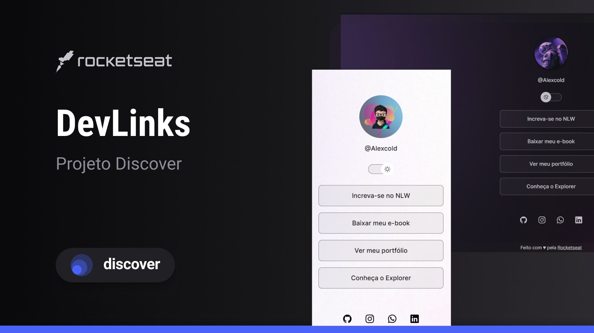

<h1 align= "center">DevLinks
</h1>
 
Programa exclusivo e gratuito, promovido pela Rocketseat para ensino de tecnologia WEB. 
 

  
  

  ## 🖥️ Projeto 
  
  O DevLinks é um agregador de links para usar como cartão de visitas online.

  ## 🚀 Tecnologias
  Esse projeto foi desenvolvido durante o discover da Rocketset, com as seguintes tecnologias:

  - HTML
  - CSS
  - Javascript
  - Git e Github

  ## 🏷️ Layout
  Você pode visualizar o layout do projeto através 
  [desse link](https://www.figma.com/community/file/1187422022288947321/DevLinks-%E2%80%A2-Projeto-Discover).
  É necessário ter uma conta no [Figma](https://www.figma.com)

---
  
  Feito com 💖 by Rocketseat 🌊 [Participe da nossa comunidade!](https://discord.gg/rocketseat)